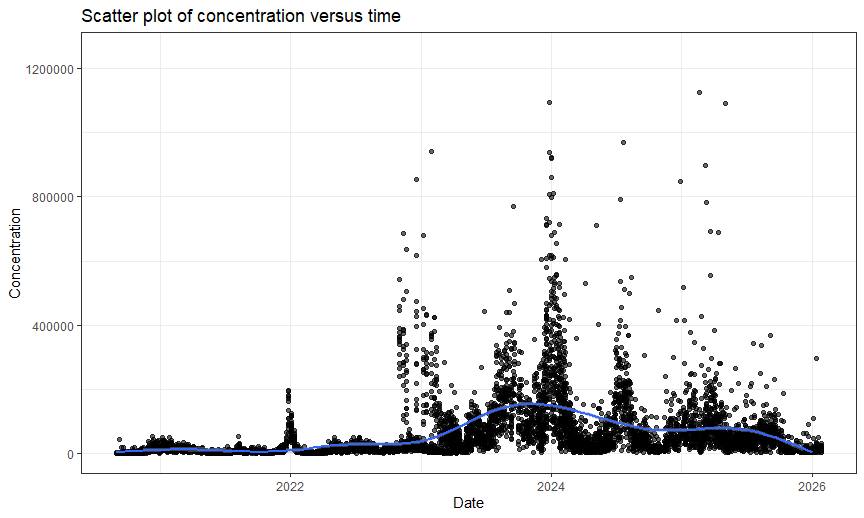
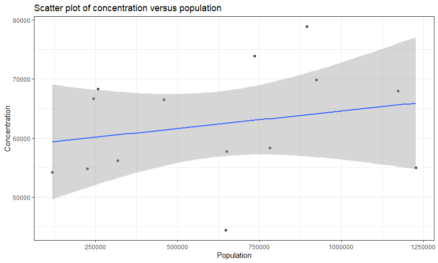

Data analysis-2026/02/22
================
Jicong Zhang
2026-02-23

``` r
# Data input
wastewater = read.csv("./Data/wastewater.csv") %>%
  janitor::clean_names() %>%
  rename(wrrf = wrrf_name,
         abbreviation = wrrf_abbreviation,
         concentration = concentration_sars_co_v_2_gene_target_n1_copies_l,
         population = population_served_estimated,
         per_Sars_load = per_capita_sars_co_v_2_load_n1_copies_per_day_per_population) %>%
  select(-annotation)
```

``` r
wastewater_clean = wastewater %>%
  mutate(population = parse_number(population),
         concentration = parse_number(concentration),
         date = mdy(sample_date)) %>%
  filter(!is.na(population),
         !is.na(concentration),
         !is.na(date)) %>%
  select(date, wrrf, concentration, population) %>%
  mutate(log_population = log(population))
```

``` r
# Create a descriptive_table
descriptive_table = wastewater_clean %>%
  select(-date) %>%
   gtsummary::tbl_summary(type = all_continuous() ~ "continuous2",
                          statistic = list(all_continuous2() ~ c("{mean} ({sd})", "{min} - {max}"),
                                          all_categorical() ~ "{n}, {p}%"))
descriptive_table
```

<div id="ydgabwknrs" style="padding-left:0px;padding-right:0px;padding-top:10px;padding-bottom:10px;overflow-x:auto;overflow-y:auto;width:auto;height:auto;">
<style>#ydgabwknrs table {
  font-family: system-ui, 'Segoe UI', Roboto, Helvetica, Arial, sans-serif, 'Apple Color Emoji', 'Segoe UI Emoji', 'Segoe UI Symbol', 'Noto Color Emoji';
  -webkit-font-smoothing: antialiased;
  -moz-osx-font-smoothing: grayscale;
}
&#10;#ydgabwknrs thead, #ydgabwknrs tbody, #ydgabwknrs tfoot, #ydgabwknrs tr, #ydgabwknrs td, #ydgabwknrs th {
  border-style: none;
}
&#10;#ydgabwknrs p {
  margin: 0;
  padding: 0;
}
&#10;#ydgabwknrs .gt_table {
  display: table;
  border-collapse: collapse;
  line-height: normal;
  margin-left: auto;
  margin-right: auto;
  color: #333333;
  font-size: 16px;
  font-weight: normal;
  font-style: normal;
  background-color: #FFFFFF;
  width: auto;
  border-top-style: solid;
  border-top-width: 2px;
  border-top-color: #A8A8A8;
  border-right-style: none;
  border-right-width: 2px;
  border-right-color: #D3D3D3;
  border-bottom-style: solid;
  border-bottom-width: 2px;
  border-bottom-color: #A8A8A8;
  border-left-style: none;
  border-left-width: 2px;
  border-left-color: #D3D3D3;
}
&#10;#ydgabwknrs .gt_caption {
  padding-top: 4px;
  padding-bottom: 4px;
}
&#10;#ydgabwknrs .gt_title {
  color: #333333;
  font-size: 125%;
  font-weight: initial;
  padding-top: 4px;
  padding-bottom: 4px;
  padding-left: 5px;
  padding-right: 5px;
  border-bottom-color: #FFFFFF;
  border-bottom-width: 0;
}
&#10;#ydgabwknrs .gt_subtitle {
  color: #333333;
  font-size: 85%;
  font-weight: initial;
  padding-top: 3px;
  padding-bottom: 5px;
  padding-left: 5px;
  padding-right: 5px;
  border-top-color: #FFFFFF;
  border-top-width: 0;
}
&#10;#ydgabwknrs .gt_heading {
  background-color: #FFFFFF;
  text-align: center;
  border-bottom-color: #FFFFFF;
  border-left-style: none;
  border-left-width: 1px;
  border-left-color: #D3D3D3;
  border-right-style: none;
  border-right-width: 1px;
  border-right-color: #D3D3D3;
}
&#10;#ydgabwknrs .gt_bottom_border {
  border-bottom-style: solid;
  border-bottom-width: 2px;
  border-bottom-color: #D3D3D3;
}
&#10;#ydgabwknrs .gt_col_headings {
  border-top-style: solid;
  border-top-width: 2px;
  border-top-color: #D3D3D3;
  border-bottom-style: solid;
  border-bottom-width: 2px;
  border-bottom-color: #D3D3D3;
  border-left-style: none;
  border-left-width: 1px;
  border-left-color: #D3D3D3;
  border-right-style: none;
  border-right-width: 1px;
  border-right-color: #D3D3D3;
}
&#10;#ydgabwknrs .gt_col_heading {
  color: #333333;
  background-color: #FFFFFF;
  font-size: 100%;
  font-weight: normal;
  text-transform: inherit;
  border-left-style: none;
  border-left-width: 1px;
  border-left-color: #D3D3D3;
  border-right-style: none;
  border-right-width: 1px;
  border-right-color: #D3D3D3;
  vertical-align: bottom;
  padding-top: 5px;
  padding-bottom: 6px;
  padding-left: 5px;
  padding-right: 5px;
  overflow-x: hidden;
}
&#10;#ydgabwknrs .gt_column_spanner_outer {
  color: #333333;
  background-color: #FFFFFF;
  font-size: 100%;
  font-weight: normal;
  text-transform: inherit;
  padding-top: 0;
  padding-bottom: 0;
  padding-left: 4px;
  padding-right: 4px;
}
&#10;#ydgabwknrs .gt_column_spanner_outer:first-child {
  padding-left: 0;
}
&#10;#ydgabwknrs .gt_column_spanner_outer:last-child {
  padding-right: 0;
}
&#10;#ydgabwknrs .gt_column_spanner {
  border-bottom-style: solid;
  border-bottom-width: 2px;
  border-bottom-color: #D3D3D3;
  vertical-align: bottom;
  padding-top: 5px;
  padding-bottom: 5px;
  overflow-x: hidden;
  display: inline-block;
  width: 100%;
}
&#10;#ydgabwknrs .gt_spanner_row {
  border-bottom-style: hidden;
}
&#10;#ydgabwknrs .gt_group_heading {
  padding-top: 8px;
  padding-bottom: 8px;
  padding-left: 5px;
  padding-right: 5px;
  color: #333333;
  background-color: #FFFFFF;
  font-size: 100%;
  font-weight: initial;
  text-transform: inherit;
  border-top-style: solid;
  border-top-width: 2px;
  border-top-color: #D3D3D3;
  border-bottom-style: solid;
  border-bottom-width: 2px;
  border-bottom-color: #D3D3D3;
  border-left-style: none;
  border-left-width: 1px;
  border-left-color: #D3D3D3;
  border-right-style: none;
  border-right-width: 1px;
  border-right-color: #D3D3D3;
  vertical-align: middle;
  text-align: left;
}
&#10;#ydgabwknrs .gt_empty_group_heading {
  padding: 0.5px;
  color: #333333;
  background-color: #FFFFFF;
  font-size: 100%;
  font-weight: initial;
  border-top-style: solid;
  border-top-width: 2px;
  border-top-color: #D3D3D3;
  border-bottom-style: solid;
  border-bottom-width: 2px;
  border-bottom-color: #D3D3D3;
  vertical-align: middle;
}
&#10;#ydgabwknrs .gt_from_md > :first-child {
  margin-top: 0;
}
&#10;#ydgabwknrs .gt_from_md > :last-child {
  margin-bottom: 0;
}
&#10;#ydgabwknrs .gt_row {
  padding-top: 8px;
  padding-bottom: 8px;
  padding-left: 5px;
  padding-right: 5px;
  margin: 10px;
  border-top-style: solid;
  border-top-width: 1px;
  border-top-color: #D3D3D3;
  border-left-style: none;
  border-left-width: 1px;
  border-left-color: #D3D3D3;
  border-right-style: none;
  border-right-width: 1px;
  border-right-color: #D3D3D3;
  vertical-align: middle;
  overflow-x: hidden;
}
&#10;#ydgabwknrs .gt_stub {
  color: #333333;
  background-color: #FFFFFF;
  font-size: 100%;
  font-weight: initial;
  text-transform: inherit;
  border-right-style: solid;
  border-right-width: 2px;
  border-right-color: #D3D3D3;
  padding-left: 5px;
  padding-right: 5px;
}
&#10;#ydgabwknrs .gt_stub_row_group {
  color: #333333;
  background-color: #FFFFFF;
  font-size: 100%;
  font-weight: initial;
  text-transform: inherit;
  border-right-style: solid;
  border-right-width: 2px;
  border-right-color: #D3D3D3;
  padding-left: 5px;
  padding-right: 5px;
  vertical-align: top;
}
&#10;#ydgabwknrs .gt_row_group_first td {
  border-top-width: 2px;
}
&#10;#ydgabwknrs .gt_row_group_first th {
  border-top-width: 2px;
}
&#10;#ydgabwknrs .gt_summary_row {
  color: #333333;
  background-color: #FFFFFF;
  text-transform: inherit;
  padding-top: 8px;
  padding-bottom: 8px;
  padding-left: 5px;
  padding-right: 5px;
}
&#10;#ydgabwknrs .gt_first_summary_row {
  border-top-style: solid;
  border-top-color: #D3D3D3;
}
&#10;#ydgabwknrs .gt_first_summary_row.thick {
  border-top-width: 2px;
}
&#10;#ydgabwknrs .gt_last_summary_row {
  padding-top: 8px;
  padding-bottom: 8px;
  padding-left: 5px;
  padding-right: 5px;
  border-bottom-style: solid;
  border-bottom-width: 2px;
  border-bottom-color: #D3D3D3;
}
&#10;#ydgabwknrs .gt_grand_summary_row {
  color: #333333;
  background-color: #FFFFFF;
  text-transform: inherit;
  padding-top: 8px;
  padding-bottom: 8px;
  padding-left: 5px;
  padding-right: 5px;
}
&#10;#ydgabwknrs .gt_first_grand_summary_row {
  padding-top: 8px;
  padding-bottom: 8px;
  padding-left: 5px;
  padding-right: 5px;
  border-top-style: double;
  border-top-width: 6px;
  border-top-color: #D3D3D3;
}
&#10;#ydgabwknrs .gt_last_grand_summary_row_top {
  padding-top: 8px;
  padding-bottom: 8px;
  padding-left: 5px;
  padding-right: 5px;
  border-bottom-style: double;
  border-bottom-width: 6px;
  border-bottom-color: #D3D3D3;
}
&#10;#ydgabwknrs .gt_striped {
  background-color: rgba(128, 128, 128, 0.05);
}
&#10;#ydgabwknrs .gt_table_body {
  border-top-style: solid;
  border-top-width: 2px;
  border-top-color: #D3D3D3;
  border-bottom-style: solid;
  border-bottom-width: 2px;
  border-bottom-color: #D3D3D3;
}
&#10;#ydgabwknrs .gt_footnotes {
  color: #333333;
  background-color: #FFFFFF;
  border-bottom-style: none;
  border-bottom-width: 2px;
  border-bottom-color: #D3D3D3;
  border-left-style: none;
  border-left-width: 2px;
  border-left-color: #D3D3D3;
  border-right-style: none;
  border-right-width: 2px;
  border-right-color: #D3D3D3;
}
&#10;#ydgabwknrs .gt_footnote {
  margin: 0px;
  font-size: 90%;
  padding-top: 4px;
  padding-bottom: 4px;
  padding-left: 5px;
  padding-right: 5px;
}
&#10;#ydgabwknrs .gt_sourcenotes {
  color: #333333;
  background-color: #FFFFFF;
  border-bottom-style: none;
  border-bottom-width: 2px;
  border-bottom-color: #D3D3D3;
  border-left-style: none;
  border-left-width: 2px;
  border-left-color: #D3D3D3;
  border-right-style: none;
  border-right-width: 2px;
  border-right-color: #D3D3D3;
}
&#10;#ydgabwknrs .gt_sourcenote {
  font-size: 90%;
  padding-top: 4px;
  padding-bottom: 4px;
  padding-left: 5px;
  padding-right: 5px;
}
&#10;#ydgabwknrs .gt_left {
  text-align: left;
}
&#10;#ydgabwknrs .gt_center {
  text-align: center;
}
&#10;#ydgabwknrs .gt_right {
  text-align: right;
  font-variant-numeric: tabular-nums;
}
&#10;#ydgabwknrs .gt_font_normal {
  font-weight: normal;
}
&#10;#ydgabwknrs .gt_font_bold {
  font-weight: bold;
}
&#10;#ydgabwknrs .gt_font_italic {
  font-style: italic;
}
&#10;#ydgabwknrs .gt_super {
  font-size: 65%;
}
&#10;#ydgabwknrs .gt_footnote_marks {
  font-size: 75%;
  vertical-align: 0.4em;
  position: initial;
}
&#10;#ydgabwknrs .gt_asterisk {
  font-size: 100%;
  vertical-align: 0;
}
&#10;#ydgabwknrs .gt_indent_1 {
  text-indent: 5px;
}
&#10;#ydgabwknrs .gt_indent_2 {
  text-indent: 10px;
}
&#10;#ydgabwknrs .gt_indent_3 {
  text-indent: 15px;
}
&#10;#ydgabwknrs .gt_indent_4 {
  text-indent: 20px;
}
&#10;#ydgabwknrs .gt_indent_5 {
  text-indent: 25px;
}
&#10;#ydgabwknrs .katex-display {
  display: inline-flex !important;
  margin-bottom: 0.75em !important;
}
&#10;#ydgabwknrs div.Reactable > div.rt-table > div.rt-thead > div.rt-tr.rt-tr-group-header > div.rt-th-group:after {
  height: 0px !important;
}
</style>
<table class="gt_table" data-quarto-disable-processing="false" data-quarto-bootstrap="false">
  <thead>
    <tr class="gt_col_headings">
      <th class="gt_col_heading gt_columns_bottom_border gt_left" rowspan="1" colspan="1" scope="col" id="label"><span class='gt_from_md'><strong>Characteristic</strong></span></th>
      <th class="gt_col_heading gt_columns_bottom_border gt_center" rowspan="1" colspan="1" scope="col" id="stat_0"><span class='gt_from_md'><strong>N = 7,164</strong></span><span class="gt_footnote_marks" style="white-space:nowrap;font-style:italic;font-weight:normal;line-height:0;"><sup>1</sup></span></th>
    </tr>
  </thead>
  <tbody class="gt_table_body">
    <tr><td headers="label" class="gt_row gt_left">wrrf</td>
<td headers="stat_0" class="gt_row gt_center"><br /></td></tr>
    <tr><td headers="label" class="gt_row gt_left">    26th Ward</td>
<td headers="stat_0" class="gt_row gt_center">516, 7.2%</td></tr>
    <tr><td headers="label" class="gt_row gt_left">    Bowery Bay</td>
<td headers="stat_0" class="gt_row gt_center">513, 7.2%</td></tr>
    <tr><td headers="label" class="gt_row gt_left">    Coney Island</td>
<td headers="stat_0" class="gt_row gt_center">506, 7.1%</td></tr>
    <tr><td headers="label" class="gt_row gt_left">    Hunts Point</td>
<td headers="stat_0" class="gt_row gt_center">515, 7.2%</td></tr>
    <tr><td headers="label" class="gt_row gt_left">    Jamaica Bay</td>
<td headers="stat_0" class="gt_row gt_center">520, 7.3%</td></tr>
    <tr><td headers="label" class="gt_row gt_left">    Newtown Creek</td>
<td headers="stat_0" class="gt_row gt_center">486, 6.8%</td></tr>
    <tr><td headers="label" class="gt_row gt_left">    North River</td>
<td headers="stat_0" class="gt_row gt_center">511, 7.1%</td></tr>
    <tr><td headers="label" class="gt_row gt_left">    Oakwood Beach</td>
<td headers="stat_0" class="gt_row gt_center">517, 7.2%</td></tr>
    <tr><td headers="label" class="gt_row gt_left">    Owls Head</td>
<td headers="stat_0" class="gt_row gt_center">515, 7.2%</td></tr>
    <tr><td headers="label" class="gt_row gt_left">    Port Richmond</td>
<td headers="stat_0" class="gt_row gt_center">511, 7.1%</td></tr>
    <tr><td headers="label" class="gt_row gt_left">    Red Hook</td>
<td headers="stat_0" class="gt_row gt_center">515, 7.2%</td></tr>
    <tr><td headers="label" class="gt_row gt_left">    Rockaway</td>
<td headers="stat_0" class="gt_row gt_center">511, 7.1%</td></tr>
    <tr><td headers="label" class="gt_row gt_left">    Tallman Island</td>
<td headers="stat_0" class="gt_row gt_center">512, 7.1%</td></tr>
    <tr><td headers="label" class="gt_row gt_left">    Wards Island</td>
<td headers="stat_0" class="gt_row gt_center">516, 7.2%</td></tr>
    <tr><td headers="label" class="gt_row gt_left">concentration</td>
<td headers="stat_0" class="gt_row gt_center"><br /></td></tr>
    <tr><td headers="label" class="gt_row gt_left">    Mean (SD)</td>
<td headers="stat_0" class="gt_row gt_center">62,406 (106,284)</td></tr>
    <tr><td headers="label" class="gt_row gt_left">    Min - Max</td>
<td headers="stat_0" class="gt_row gt_center">30 - 2,069,714</td></tr>
    <tr><td headers="label" class="gt_row gt_left">population</td>
<td headers="stat_0" class="gt_row gt_center"><br /></td></tr>
    <tr><td headers="label" class="gt_row gt_left">    Mean (SD)</td>
<td headers="stat_0" class="gt_row gt_center">616,070 (345,425)</td></tr>
    <tr><td headers="label" class="gt_row gt_left">    Min - Max</td>
<td headers="stat_0" class="gt_row gt_center">117,991 - 1,227,810</td></tr>
    <tr><td headers="label" class="gt_row gt_left">log_population</td>
<td headers="stat_0" class="gt_row gt_center"><br /></td></tr>
    <tr><td headers="label" class="gt_row gt_left">    Mean (SD)</td>
<td headers="stat_0" class="gt_row gt_center">13.13 (0.69)</td></tr>
    <tr><td headers="label" class="gt_row gt_left">    Min - Max</td>
<td headers="stat_0" class="gt_row gt_center">11.68 - 14.02</td></tr>
  </tbody>
  <tfoot>
    <tr class="gt_footnotes">
      <td class="gt_footnote" colspan="2"><span class="gt_footnote_marks" style="white-space:nowrap;font-style:italic;font-weight:normal;line-height:0;"><sup>1</sup></span> <span class='gt_from_md'>n, %</span></td>
    </tr>
  </tfoot>
</table>
</div>

``` r
# Scatter plot of concentration versus time
con_time_plot = wastewater_clean %>%
  ggplot(aes(x = date, y = concentration)) +
  geom_point(alpha = 0.6) +
  geom_smooth() +
  theme_bw() +
  labs(title = "Scatter plot of concentration versus time",
       x= "Date",
       y = "Concentration") +
  scale_y_continuous(limits = c(0, 1250000))
con_time_plot
```

    ## `geom_smooth()` using method = 'gam' and formula = 'y ~ s(x, bs = "cs")'

    ## Warning: Removed 4 rows containing non-finite outside the scale range
    ## (`stat_smooth()`).

    ## Warning: Removed 4 rows containing missing values or values outside the scale range
    ## (`geom_point()`).

    ## Warning: Removed 1 row containing missing values or values outside the scale range
    ## (`geom_smooth()`).



``` r
# Scatter plot of concentration versus population
con_pop_plot = wastewater_clean %>%
  group_by(population) %>%
  summarize(mean_concentration = mean(concentration)) %>%
  ggplot(aes(x = population, y = mean_concentration)) +
  geom_point(alpha = 0.6) +
  geom_smooth(method = "lm", se = TRUE) +
  theme_bw() +
  labs(title = "Scatter plot of concentration versus population",
       x = "Population",
       y = "Concentration")
con_pop_plot
```

    ## `geom_smooth()` using formula = 'y ~ x'



``` r
# Correlation test
cor_test = cor.test(wastewater_clean$population,
                    wastewater_clean$concentration,
                    method = "pearson")
cor_test
```

    ## 
    ##  Pearson's product-moment correlation
    ## 
    ## data:  wastewater_clean$population and wastewater_clean$concentration
    ## t = 1.6863, df = 7162, p-value = 0.09178
    ## alternative hypothesis: true correlation is not equal to 0
    ## 95 percent confidence interval:
    ##  -0.003236466  0.043059302
    ## sample estimates:
    ##       cor 
    ## 0.0199221

``` r
cor_test$estimate
```

    ##       cor 
    ## 0.0199221

``` r
cor_test$p.value
```

    ## [1] 0.09177892

``` r
cor_test$conf.int
```

    ## [1] -0.003236466  0.043059302
    ## attr(,"conf.level")
    ## [1] 0.95

``` r
model1 = lm(concentration ~ population, data = wastewater_clean)
summary(model1)
```

    ## 
    ## Call:
    ## lm(formula = concentration ~ population, data = wastewater_clean)
    ## 
    ## Residuals:
    ##     Min      1Q  Median      3Q     Max 
    ##  -65975  -54840  -39129   10090 2009708 
    ## 
    ## Coefficients:
    ##              Estimate Std. Error t value Pr(>|t|)    
    ## (Intercept) 5.863e+04  2.567e+03  22.836   <2e-16 ***
    ## population  6.130e-03  3.635e-03   1.686   0.0918 .  
    ## ---
    ## Signif. codes:  0 '***' 0.001 '**' 0.01 '*' 0.05 '.' 0.1 ' ' 1
    ## 
    ## Residual standard error: 106300 on 7162 degrees of freedom
    ## Multiple R-squared:  0.0003969,  Adjusted R-squared:  0.0002573 
    ## F-statistic: 2.844 on 1 and 7162 DF,  p-value: 0.09178

``` r
model_results <- tidy(model1, conf.int = TRUE)

knitr::kable(model_results, digits = 3)
```

| term        |  estimate | std.error | statistic | p.value |  conf.low | conf.high |
|:------------|----------:|----------:|----------:|--------:|----------:|----------:|
| (Intercept) | 58629.620 |  2567.388 |    22.836 |   0.000 | 53596.781 | 63662.460 |
| population  |     0.006 |     0.004 |     1.686 |   0.092 |    -0.001 |     0.013 |
